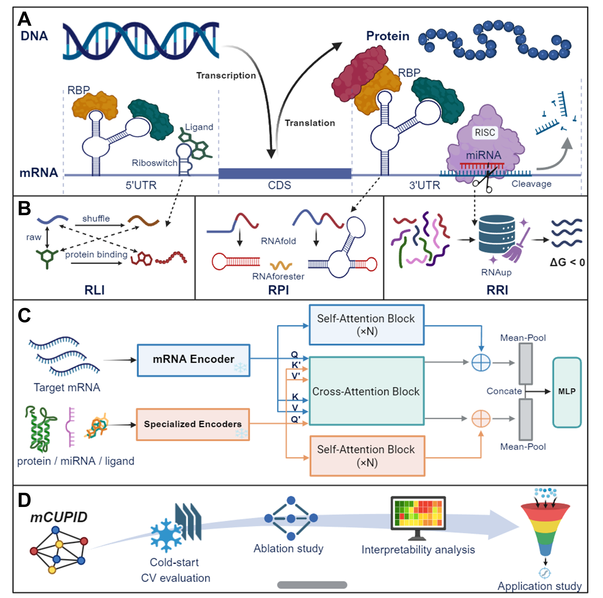

# mCUPID: mRNA-Centric Unified Predictor of Interactions

mCUPID (**m**RNA-**C**entric **U**nified **P**re**d**ictor of **I**nteractions) is a unified deep learning framework integrating specialized pre-trained language models (PLMs) with a cross-attention mechanism, complemented by mCUPIDBench, a benchmark dataset employing biologically-informed negative sampling strategies to mitigate data bias. mCUPID is designed to systematically predict the interactions between mRNA and proteins (RPI), miRNAs (RRI), and small molecule ligands (RLI) based solely on sequence information.



## Project Structure

```
mCUPID/
├── RRI/                 # miRNA-mRNA interaction prediction module
│   ├── data/            # Training and test data
│   ├── embeddings/      # Precomputed embeddings
│   ├── saved_models/    # Trained models
│   ├── extract_embedding_RRI.py  # Embedding extraction script
│   └── train_RRI.py     # Model training script
├── RLI/                 # mRNA-small molecule ligand interaction prediction module
├── RPI/                 # Protein-mRNA interaction prediction module
├── predict.py       # Prediction script 
└── mcupid_models.py     # Core model definitions
```

mCUPIDBench is available on [Zenodo](https://zenodo.org/records/17578976). You need to first download the datasets and extract them to the data directory of each folder.

## Environment Requirements

Install dependencies:
```bash
pip install -r requirements.txt
pip uninstall triton
```

## Usage

We use RRI as an example for illustration. The usage for other interaction types is similar - you only need to modify the input file paths and encoders. For paths to pre-trained models and embedding extraction methods, please refer to [mRNABERT](https://huggingface.co/YYLY66/mRNABERT), [RiNALMo](https://github.com/lbcb-sci/RiNALMo), [ESM2-33](https://huggingface.co/facebook/esm2_t33_650M_UR50D), and [MoLFormer](https://huggingface.co/ibm-research/MoLFormer-XL-both-10pct).

Note that for code uniformity and convenience, similar to CPI prediction, the code uses unified definitions of 'prot' and 'drug', which represent different molecules in different interaction types:

| Type   | Prot          | Drug                  |
|--------|---------------|-----------------------|
| RRI    | miRNA         | mRNA                  |
| RPI    | Protein       | mRNA                  |
| RLI    | mRNA          | Small molecule ligand |

### 1. Embedding Extraction

First, use pre-trained RNA encoders to extract embeddings for miRNA and mRNA sequences.

```bash
cd RRI

python extract_embedding_RRI.py \
    --csv_path  ./data/train_all.csv \
    --output_dir  ./embeddings \
    --prot_encoder_path /path/to/miRNA_encoder \  # e.g., multimolecule/rinalmo-giga
    --drug_encoder_path /path/to/mRNA_encoder \   # e.g., YYLY6/mRNABERT
```

Parameters:
- `--csv_path`: Path to CSV file containing miRNA and mRNA sequences
- `--output_dir`: Directory to save embeddings
- `--prot_encoder_path`: Path to miRNA encoder model, change according to molecule type
- `--drug_encoder_path`: Path to mRNA encoder model, change according to molecule type
- `--batch_size`: Batch size for processing

Input CSV file format should include the following columns:
- `miRNA_ID`: miRNA identifier
- `mRNA_ID`: mRNA identifier
- `miRNA_Sequence`: miRNA sequence
- `mRNA_Sequence`: mRNA sequence

Output files:
- `protein_embeddings.pkl`: miRNA embeddings
- `protein_masks.pkl`: miRNA attention masks
- `drug_embeddings.pkl`: mRNA embeddings
- `drug_masks.pkl`: mRNA attention masks

### 2. Model Training

Train the model using the extracted embeddings and cross-validation setup:

```bash
python train_RRI.py \
    --data_dir /path/to/data_folds \
    --prot_embed_path /path/to/embeddings/protein_embeddings.pkl \
    --prot_mask_path /path/to/embeddings/protein_masks.pkl \
    --drug_embed_path /path/to/embeddings/drug_embeddings.pkl \
    --drug_mask_path /path/to/embeddings/drug_masks.pkl \
    --prot_dim 1280 \
    --drug_dim 768 \
    --fusion CAN \
    --agg_mode mean_all_tok \
    --batch_size 256 \
    --patience 20 \
    --save_dir /path/to/saved_models
```

Parameters:
- `--data_dir`: Directory containing training and test folds data
- `--prot_embed_path`: Path to miRNA embedding file
- `--prot_mask_path`: Path to miRNA mask file
- `--drug_embed_path`: Path to mRNA embedding file
- `--drug_mask_path`: Path to mRNA mask file
- `--prot_dim`: Dimension of miRNA embeddings
- `--drug_dim`: Dimension of mRNA embeddings
- `--fusion`: Fusion method (CAN or None)
- `--agg_mode`: Sequence representation aggregation mode
- `--batch_size`: Training batch size
- `--patience`: Early stopping patience value
- `--save_dir`: Directory to save models

The training script supports three different training settings:
1. **Warm start**: Randomly split training/test sets
2. **miRNA cold start**: miRNAs do not overlap between training and test sets
3. **mRNA cold start**: mRNAs do not overlap between training and test sets

The training script will automatically select the corresponding training setting based on `--data_dir` and split `train_fold_k.csv` into training and validation sets according to the setting.

### 3. Prediction

Use trained models to predict new miRNA-mRNA pairs. Before prediction, first compute embeddings for the data to be predicted using step 1:

```bash
cd ..
# Single model prediction
python predict.py \
    --test_csv /path/to/test.csv \
    --prot_embed_path /path/to/embeddings/protein_embeddings.pkl \
    --prot_mask_path /path/to/embeddings/protein_masks.pkl \
    --drug_embed_path /path/to/embeddings/drug_embeddings.pkl \
    --drug_mask_path /path/to/embeddings/drug_masks.pkl \
    --model_path /path/to/model.pt \
    --output_file /path/to/predictions.csv

# Ensemble model prediction (recommended)
python predict.py \
    --test_csv /path/to/test.csv \
    --prot_embed_path /path/to/embeddings/protein_embeddings.pkl \
    --prot_mask_path /path/to/embeddings/protein_masks.pkl \
    --drug_embed_path /path/to/embeddings/drug_embeddings.pkl \
    --drug_mask_path /path/to/embeddings/drug_masks.pkl \
    --prot_id_col miRNA_ID \
    --drug_id_col mRNA_ID \
    --model_dir /path/to/saved_models \
    --output_file /path/to/predictions.csv
```

Parameters:
- `--test_csv`: Path to test data CSV file
- `--prot_embed_path`: Path to miRNA embedding file
- `--prot_mask_path`: Path to miRNA mask file
- `--drug_embed_path`: Path to mRNA embedding file
- `--drug_mask_path`: Path to mRNA mask file
- `--prot_id_col`: miRNA identifier column name in test CSV file, change according to molecule type 
- `--drug_id_col`: mRNA identifier column name in test CSV file, change according to molecule type
- `--model_path`: Path to single model file (mutually exclusive with --model_dir)
- `--model_dir`: Model directory (for ensemble prediction)
- `--output_file`: Output file path for prediction results

For RPI or RLI training and prediction, simply run the scripts in the corresponding folders and change the input encoder and file paths. The process is identical. You need to choose different `batch sizes` and `epochs` based on the dataset to achieve optimal results. Additionally, you should select the optimal `max_length` based on input sequence length. Incidentally, you can also use this code to test a benchmark for other interactions by using different encoders.


## Performance Evaluation

The model is evaluated on multiple metrics:
- AUC (Area Under ROC Curve)
- AUPR (Area Under Precision-Recall Curve)
- Accuracy
- Precision
- Recall
- F1 Score
- MCC (Matthews Correlation Coefficient)


## Citation

If you find the models and data useful in your research, please cite our paper:

```

```

## Contact

If you have any questions, please feel free to email us at xiongying@zju.edu.cn.